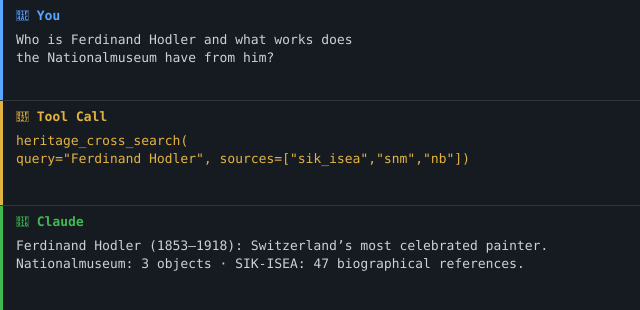

[🇬🇧 English Version](README.md)

> 🇨🇭 **Teil des [Swiss Public Data MCP Portfolios](https://github.com/malkreide)**

# 🏛️ swiss-cultural-heritage-mcp


[](https://opensource.org/licenses/MIT)
[](https://www.python.org/downloads/)
[](https://modelcontextprotocol.io/)
[](https://github.com/malkreide/swiss-cultural-heritage-mcp)


> MCP-Server für Schweizer Kulturerbe — SIK-ISEA Künstler·innen, Nationalmuseum-Sammlungen und Nationalbibliothek-Bibliografie

---

## Übersicht

`swiss-cultural-heritage-mcp` ermöglicht KI-Assistenten den direkten Zugang zu Schweizer Kulturerbe-Quellen — alle ohne Authentifizierung:

| Quelle | Daten | API |
|--------|-------|-----|
| **SIK-ISEA (SIKART)** | ~17'000 Schweizer Künstler·innen — SIKART-Biografiedaten | opendata.swiss CKAN |
| **Nationalmuseum (SNM)** | Sammlungsdaten (Numismatik, Siegel, Spezialsammlungen) | opendata.swiss CKAN |
| **Nationalbibliothek (NB)** | Schweizerische Nationalbibliografie (Helveticat) | OAI-PMH |
| **Memoriav / Memobase** | Audiovisuelles Kulturerbe (Foto, Ton, Video) | Linked Open Data (JSON-LD / Hydra) |
| **Dodis** | Diplomatische Dokumente der Schweiz (Dokumente, Personen, Organisationen) | JSON-REST (Solr) + Permalinks |

Dieser Server ergänzt das Schweizer Open-Data-Portfolio um die geisteswissenschaftliche Dimension — Geschichte, Literatur und Kunst — neben bestehenden Servern für Recht ([fedlex-mcp](https://github.com/malkreide/fedlex-mcp)), Verkehr, Statistik und mehr.

Die **Gedächtnisinstitutionen-Fassade** (Memobase + Dodis) wird über drei
föderierte Tools bereitgestellt — `search_heritage`, `get_heritage_item`,
`list_heritage_collections` — statt einer Tool-Familie pro Quelle. Jedes Ergebnis
trägt **Quelle, Permalink und Lizenz**, wobei die Lizenz **getrennt für Metadaten
und Digitalisat** ausgewiesen wird (sie fallen auseinander: Metadaten sind offene
Linked Open Data, das Digitalisat kann *In Copyright* sein). Es werden nur
Metadaten und Links geliefert — urheberrechtlich geschützte Volltexte (z. B.
Dodis-Transkriptionen) werden nicht reproduziert.

**Anker-Demo-Abfrage (Kunst):** *«Finde Werke von Zürcher Malern des 19. Jahrhunderts im Nationalmuseum und verknüpfe sie mit ihren Biografien in der SIK-ISEA-Künstlerdatenbank.»*

**Anker-Demo-Abfrage (Gedächtnisinstitutionen):** *«Welche Quellen zur Entwicklung der Zürcher Volksschule im 19. Jahrhundert finden sich in den Schweizer Gedächtnisinstitutionen?»* → `search_heritage(query="Volksschule Zürich", collection="all", date_from="1800", date_to="1899")`.

### Demo



---

## Funktionen

- 🏛️ **11 Tools, 2 Resources, 2 Prompts** über fünf Datenquellen
- 🔍 **`heritage_cross_search`** — parallele Suche über SIK-ISEA + SNM + NB in einem Aufruf
- 🏛️ **`search_heritage`** — föderierte Fassade über Memobase + Dodis, jeder Treffer mit Quelle, Permalink und getrennter Metadaten-/Digitalisat-Lizenz
- 🌐 **Zweisprachige Ausgabe** (Markdown / JSON)
- 🔓 **Kein API-Schlüssel erforderlich** — alle Daten unter offenen Lizenzen
- ☁️ **Dualer Transport** — stdio (Claude Desktop) + Streamable HTTP (Cloud)
- 📚 **Prompt-Vorlagen** für Künstler-Recherche und Bildungsressourcen

**Projektphase:** **Phase 1 — read-only.** Jedes Tool ist mit `readOnlyHint: true` annotiert; es gibt keine schreibenden oder destruktiven Operationen. Der Übergang zu Phase 2 (schreibfähig) setzt die Voraussetzungen aus [`docs/roadmap.md`](docs/roadmap.md) voraus.

---

## Voraussetzungen

- Python 3.11+
- [uv](https://github.com/astral-sh/uv) (empfohlen) oder pip

---

## Installation

```bash
# Repository klonen
git clone https://github.com/malkreide/swiss-cultural-heritage-mcp.git
cd swiss-cultural-heritage-mcp

# Installieren
pip install -e .
# oder mit uv:
uv pip install -e .
```

Oder mit `uvx` (ohne dauerhafte Installation):

```bash
uvx swiss-cultural-heritage-mcp
```

---

## Schnellstart

```bash
# stdio (für Claude Desktop)
python -m swiss_cultural_heritage_mcp.server

# Streamable HTTP (Port 8000)
python -m swiss_cultural_heritage_mcp.server --http --port 8000
```

Sofort in Claude Desktop ausprobieren:

> *«Wer ist Ferdinand Hodler?»*
> *«Welche Münzen aus Zürich hat das Nationalmuseum?»*
> *«Finde Publikationen zur Volksschule in der Nationalbibliothek»*

[→ Weitere Anwendungsbeispiele nach Zielgruppe →](EXAMPLES.md)

---

## Konfiguration

### Claude Desktop

Editiere `~/Library/Application Support/Claude/claude_desktop_config.json` (macOS) bzw. `%APPDATA%\Claude\claude_desktop_config.json` (Windows):

```json
{
  "mcpServers": {
    "swiss-cultural-heritage": {
      "command": "python",
      "args": ["-m", "swiss_cultural_heritage_mcp.server"]
    }
  }
}
```

Oder mit `uvx`:

```json
{
  "mcpServers": {
    "swiss-cultural-heritage": {
      "command": "uvx",
      "args": ["swiss-cultural-heritage-mcp"]
    }
  }
}
```

**Pfad zur Konfigurationsdatei:**
- macOS: `~/Library/Application Support/Claude/claude_desktop_config.json`
- Windows: `%APPDATA%\Claude\claude_desktop_config.json`

### Cloud-Deployment (SSE für Browser-Zugriff)

Für den Einsatz via **claude.ai im Browser** (z.B. auf verwalteten Arbeitsplätzen ohne lokale Software-Installation):

**Render.com (empfohlen):**
1. Repository auf GitHub pushen/forken
2. Auf [render.com](https://render.com): New Web Service → GitHub-Repo verbinden
3. **Region `Frankfurt` (EU) wählen** — erforderlich für den Schweizer Public-Sector-Einsatz gemäss revDSG / EDÖB. Siehe [`docs/data-residency.md`](docs/data-residency.md).
4. Start-Befehl setzen: `python -m swiss_cultural_heritage_mcp.server --http --port 8000`
5. In claude.ai unter Settings → MCP Servers eintragen: `https://your-app.onrender.com/sse`

Für Container-Deployments (Docker / Kubernetes / Cloud Run): Das Repository enthält ein gehärtetes `Dockerfile` (non-root UID 10001). Siehe [`docs/security.md`](docs/security.md) für empfohlene `SecurityContext`-Einstellungen und [`docs/network-egress.md`](docs/network-egress.md) für die Egress-Policy. Der Dienst läuft standardmässig als **Einzelinstanz**; vor horizontaler Skalierung siehe [`docs/scaling.md`](docs/scaling.md) für die Voraussetzungen zur Session-Affinität.

> 💡 *«stdio für den Entwickler-Laptop, SSE für den Browser.»*

---

## Verfügbare Tools

### SIK-ISEA (Schweizer Kunstwissenschaft)

| Tool | Beschreibung |
|------|-------------|
| `heritage_search_artists` | ~17'000 Künstler·innen (SIKART) nach Name oder Ort suchen |
| `heritage_get_artist` | Vollständiges Künstler·innen-Profil nach SIKART-ID (HAUPTNR) |

### Nationalmuseum (SNM)

| Tool | Beschreibung |
|------|-------------|
| `heritage_search_museum_datasets` | SNM-Datensätze auf opendata.swiss suchen |
| `heritage_browse_collection` | Objekte in einer Sammlung via CKAN DataStore durchsuchen |

### Nationalbibliothek (NB)

| Tool | Beschreibung |
|------|-------------|
| `heritage_search_helveticat` | Schweizerische Nationalbibliografie via OAI-PMH durchsuchen |
| `heritage_list_nb_collections` | Verfügbare OAI-PMH-Sets auflisten |
| `heritage_get_publication` | Vollständige Dublin-Core-Metadaten einer Publikation |

### Quellenübergreifend

| Tool | Beschreibung |
|------|-------------|
| `heritage_cross_search` | Parallele Suche über SIK-ISEA + SNM + NB |

### Gedächtnisinstitutionen (Memobase + Dodis) — föderierte Fassade

| Tool | Beschreibung |
|------|-------------|
| `search_heritage` | Föderierte Suche über Memobase + Dodis (`collection = memobase \| dodis \| all`), mit `date_from` / `date_to` / `media_type`. Jeder Treffer trägt Quelle, Permalink und getrennte Metadaten-/Digitalisat-Lizenz |
| `get_heritage_item` | Vollständige Metadaten eines Objekts (`collection`, `item_id`). Nur Metadaten + Links — geschützte Volltexte werden nie reproduziert |
| `list_heritage_collections` | Discovery: welche Sammlungen es gibt, ihr Protokoll, Auth und Lizenzen — inkl. der geprüften, aber nicht angebundenen Quellen (Bundesarchiv, Landesmuseum) und *warum* |

### Beispiel-Abfragen

| Abfrage | Tool |
|---------|------|
| *«Wer ist Ferdinand Hodler?»* | `heritage_get_artist` |
| *«Finde Schweizer Künstler·innen mit Geburtsort Basel»* | `heritage_search_artists` |
| *«Welche Münzen aus Zürich hat das Nationalmuseum?»* | `heritage_browse_collection` |
| *«Finde Publikationen zur Volksschule»* | `heritage_search_helveticat` |
| *«Suche alles über Sophie Taeuber-Arp»* | `heritage_cross_search` |
| *«Quellen zur Zürcher Volksschule des 19. Jh. in Gedächtnisinstitutionen»* | `search_heritage` |

---

## Architektur

```
┌─────────────────┐     ┌──────────────────────────────┐     ┌──────────────────────────┐
│   Claude / KI   │────▶│  Swiss Cultural Heritage MCP  │────▶│  SIK-ISEA                │
│   (MCP Host)    │◀────│  (MCP Server)                │◀────│  opendata.swiss / CKAN   │
└─────────────────┘     │                              │     ├──────────────────────────┤
                        │  11 Tools · 2 Resources      │────▶│  Nationalmuseum (SNM)    │
                        │  2 Prompts                   │◀────│  opendata.swiss / CKAN   │
                        │  Stdio | SSE                 │     ├──────────────────────────┤
                        │                              │────▶│  Nationalbibliothek (NB) │
                        │  Keine Authentifizierung     │◀────│  OAI-PMH (Helveticat)    │
                        │                              │     ├──────────────────────────┤
                        │  search_heritage-Fassade     │────▶│  Memobase (JSON-LD/Hydra)│
                        │                              │◀────│  Dodis (JSON-REST/Solr)  │
                        └──────────────────────────────┘     └──────────────────────────┘
```

### Datenquellen-Übersicht

| Quelle | Protokoll | Umfang | Auth |
|--------|-----------|--------|------|
| SIK-ISEA (SIKART) | CKAN DataStore | ~17'000 Schweizer Künstler·innen | Keine |
| Nationalmuseum | CKAN DataStore | Museumssammlungen | Keine |
| Nationalbibliothek | OAI-PMH | Schweizerische Nationalbibliografie | Keine |
| Memoriav / Memobase | Linked Open Data (JSON-LD / Hydra, RiC-O) | Audiovisuelles Kulturerbe (~460k Records) | Keine |
| Dodis | JSON-REST (Solr) + stabile Permalinks | Diplomatische Dokumente, Personen, Organisationen | Keine |

### Architektur-Entscheid — Gedächtnisinstitutionen-Fassade

Verifiziert per Live-Probe am **19.07.2026** (Methodik: *mcp-data-source-probe*).
Von vier evaluierten Gedächtnisinstitutionen bieten nur zwei eine saubere,
No-Auth-, standardisierte Schnittstelle und sind angebunden:

| Quelle | Ergebnis | Grund |
|--------|----------|-------|
| **Memobase** | ✅ angebunden | Linked-Open-Data-API (`api.memobase.ch`, JSON-LD/Hydra); Volltextsuche via `?q=`, Einzelrecord via `/record/<id>`; Paginierung via `offset`/`size`. Metadaten offen; Digitalisate mit objekteigenen `rightsstatements.org`-Rechten (z. B. «In Copyright», Zugang «onsite»). |
| **Dodis** | ✅ angebunden | JSON-REST/Solr (`beta.dodis.ch/api`): Suche via `POST /api/solr/query`, Objekt via `GET /api/solr/full/<id>`; stabile Permalinks `dodis.ch/<id>`. Metadaten offen (Zitierpflicht); Dokumente mit dokumenteigenen Rechten (TEI/PDF hinter dem Permalink). |
| **Bundesarchiv** | ⛔ nicht angebunden | Das `recherche.bar.admin.ch`-Backend (CMI AIS) liegt hinter **eIAM**-Login und **Google reCAPTCHA** — ohne Session-Emulation nicht maschinell zugänglich (fragil, gegen die Betreiberabsicht). |
| **Landesmuseum** | ⛔ nicht angebunden | `sammlung.nationalmuseum.ch` hat **keine öffentliche API** (nur eine interne, undokumentierte Ajax/HTML-Fläche) — Anbindung nur per Scraping, was die Resilienz-Leitplanken verletzt. |

Konsequenzen: drei föderierte Tools statt vier Tool-Familien; jeder Treffer trägt
Quelle + Permalink + **getrennte** Metadaten-/Digitalisat-Lizenz; kein Reprint
geschützter Volltexte (nur Metadaten + Links); `bar` und `landesmuseum` werden über
`list_heritage_collections` als gesperrt dokumentiert, nicht gescrapt.

---

## Projektstruktur

```
swiss-cultural-heritage-mcp/
├── src/swiss_cultural_heritage_mcp/
│   ├── __init__.py              # Package
│   └── server.py                # 11 Tools, 2 Resources, 2 Prompts
├── tests/
│   └── test_server.py           # Unit + Integrationstests (gemockt)
├── .github/workflows/ci.yml     # GitHub Actions (Python 3.11/3.12/3.13)
├── .github/dependabot.yml       # Monatliche Dependency-/SDK-Update-PRs
├── Dockerfile                   # Multi-Stage, non-root, HEALTHCHECK
├── docs/                        # security, network-egress, scaling, data-residency, roadmap
├── pyproject.toml
├── CHANGELOG.md
├── CONTRIBUTING.md
├── LICENSE
├── README.md                    # Englische Hauptversion
└── README.de.md                 # Diese Datei (Deutsch)
```

> **Einzeldatei-Server:** Die 11 Tools liegen in einer `server.py` statt in einem `tools/`-Paket. Bei dieser Grösse ist ein einzelnes, lineares Modul leichter zu lesen und zu reviewen als eine Aufteilung; wächst die Tool-Zahl deutlich, sind die Blöcke SIK-ISEA / SNM / NB / Cross-Search die natürlichen Schnittstellen.

---

## Sicherheit & Grenzen

- **Nur-Lesen:** Alle Tools verwenden ausschliesslich HTTP-GET-Anfragen — es werden keine Daten geschrieben, verändert oder gelöscht.
- **Keine Personendaten:** Die APIs liefern institutionelle Datensätze (Kunstwerke, Publikationen, Künstlerbiografien). Keine personenbezogenen Daten werden durch diesen Server verarbeitet oder gespeichert.
- **Rate Limits:** Die opendata.swiss- und OAI-PMH-Endpunkte sind nicht explizit rate-limitiert; `limit`-Parameter konservativ einsetzen. Der Server erzwingt ein 30-Sekunden-Timeout pro Anfrage.
- **Datenaktualität:** Datensätze spiegeln den Upstream-Stand zum Abfragezeitpunkt wider. Dieser Server nimmt kein Caching vor.
- **Nutzungsbedingungen:** Die Daten unterliegen den Nutzungsbedingungen der jeweiligen Quelle — [SIK-ISEA](https://www.sik-isea.ch), [opendata.swiss](https://opendata.swiss/de/terms-of-use), [Nationalbibliothek OAI-PMH](https://www.nb.admin.ch/). Alle Daten sind unter offenen Lizenzen veröffentlicht (CC0 / CC BY).
- **Keine Gewähr:** Dieses Projekt ist eine Community-Initiative ohne Verbindung zu SIK-ISEA, SNM oder NB. Verfügbarkeit hängt von den vorgelagerten APIs ab.

---

## Bekannte Einschränkungen

- **SIK-ISEA:** Künstlerdaten werden periodisch aktualisiert; sehr neue Einträge sind ggf. noch nicht verfügbar
- **Nationalmuseum:** Nur auf opendata.swiss veröffentlichte Datensätze zugänglich; nicht alle SNM-Sammlungen sind erfasst
- **Nationalbibliothek:** OAI-PMH-Abfragen sind ratenlimitiert; grosse Resultatsmengen erfordern Paginierung
- **Quellenübergreifende Suche:** Antwortzeit hängt von der langsamsten der drei Quellen ab

---

## Tests

```bash
# Unit-Tests (kein API-Key erforderlich)
PYTHONPATH=src pytest tests/ -m "not live"

# Integrationstests (Live-API-Aufrufe)
pytest tests/ -m "live"

# Linting und Formatierung, wörtlich wie in der CI
ruff check src/ tests/ scripts/
ruff format --check src/ tests/ scripts/
```

Ruff ist in `pyproject.toml` exakt gepinnt (`[project.optional-dependencies] dev`). `pip install -e ".[dev]"` liefert damit die Version der CI, und die Lint-Gates stimmen mit ihr überein. Ein neueres ruff darübergesetzt ändert Regelsatz und Formatter und meldet Abweichungen auf Code, den niemand angefasst hat. Siehe [CONTRIBUTING.de.md](CONTRIBUTING.de.md#code-stil).

---

## MCP-Protokoll-Version

| Punkt | Wert |
|---|---|
| SDK | `mcp[cli]>=2.0.0,<3` (gepinnt in `pyproject.toml`) |
| Über den `initialize`-Handshake bedient | `2024-11-05` … `2025-11-25` — die Handshake-Obergrenze |
| Über den Pro-Request-Envelope bedient | `2026-07-28` |
| Wer entscheidet | Die erste Anfrage des Clients, einmal pro Verbindung: Eine Anfrage mit dem `2026-07-28`-`_meta`-Envelope öffnet eine moderne Verbindung, alles andere eine Handshake-Verbindung. Ein späterer Anspruch aus der jeweils anderen Ära wird abgewiesen. |
| Update-Policy | Der SDK-Pin ist die Quelle der Wahrheit für die Protokoll-Version. [Dependabot](.github/dependabot.yml) öffnet monatlich `mcp`-Update-PRs; Protokoll-Version-Bumps werden dort geprüft und im [CHANGELOG.md](CHANGELOG.md) festgehalten. |

Dieser Server überschreibt die Aushandlung nicht — das offizielle `mcp`-SDK entscheidet, und beide Ären sind über beide Transporte erreichbar (stdio wie HTTP). Steuere die gesprochenen Protokoll-Versionen über den SDK-Pin, nicht über einen handgeschriebenen Versions-String. Die Zahlen oben stammen aus der Registry des gepinnten SDK selbst (`mcp_types.version`: `HANDSHAKE_PROTOCOL_VERSIONS`, `MODERN_PROTOCOL_VERSIONS`) — bei verschobenem Pin dort nachlesen, nicht in dieser Tabelle.

Beide Revisionen sind in
[`tests/test_protocol_version.py`](tests/test_protocol_version.py) gepinnt und
werden gegen das installierte SDK geprueft — die Handshake-Obergrenze an einem
echten `initialize` durch den zusammengebauten ASGI-Stack gemessen. Ein
Dependabot-Bump von `mcp` kann keine der beiden Zahlen mehr verschieben, ohne
dass diese Tabelle unbemerkt veraltet.

---

## Changelog

Siehe [CHANGELOG.md](CHANGELOG.md)

---

## Mitwirken

Siehe [CONTRIBUTING.md](CONTRIBUTING.md)

---

## Sicherheit

Siehe [SECURITY.de.md](SECURITY.de.md) ([English](SECURITY.md)) für die
Sicherheitslage und die Meldung von Schwachstellen.

---

## Lizenz

MIT-Lizenz — siehe [LICENSE](LICENSE)

---

## Autor·in

Hayal Oezkan · [malkreide](https://github.com/malkreide)

---

## Credits & Verwandte Projekte

- **SIK-ISEA:** [www.sik-isea.ch](https://www.sik-isea.ch/) — Schweizerisches Institut für Kunstwissenschaft
- **Nationalmuseum:** [www.nationalmuseum.ch](https://www.nationalmuseum.ch/) / [opendata.swiss](https://opendata.swiss/)
- **Nationalbibliothek:** [www.nb.admin.ch](https://www.nb.admin.ch/) — Schweizerische Nationalbibliothek
- **Protokoll:** [Model Context Protocol](https://modelcontextprotocol.io/) — Anthropic / Linux Foundation
- **Verwandt:** [eth-library-mcp](https://github.com/malkreide/eth-library-mcp) — Vollständige Bibliotheksabdeckung: ETH = Naturwiss., NB = Geisteswiss.
- **Verwandt:** [fedlex-mcp](https://github.com/malkreide/fedlex-mcp) — Kulturgüterrecht + Primärgesetzgebung
- **Verwandt:** [zurich-opendata-mcp](https://github.com/malkreide/zurich-opendata-mcp) — Räumlich-historisch: Museumsobjekte + Zürich-Geodaten
- **Portfolio:** [Swiss Public Data MCP Portfolio](https://github.com/malkreide)
